# Mermaid gallery

Every Mermaid diagram type that `toastty md` renders, one example each. Run
this inside toastty:

```sh
toastty md docs/mermaid-gallery.md
```

toastty renders each diagram with [mermaid-svg](https://crates.io/crates/mermaid-svg)
and rasterizes it with resvg, using only the bundled fonts. Colours come from
your terminal palette, so `%%{init}%%` theme settings are ignored. If a
diagram fails to parse or goes over the size limits, toastty shows its source
as a code block instead. See [markdown.md](markdown.md) for details.

| # | Type | Keyword |
| ---: | --- | --- |
| 1 | [Flowchart](#flowchart) | `flowchart` / `graph` |
| 2 | [Sequence](#sequence-diagram) | `sequenceDiagram` |
| 3 | [Class](#class-diagram) | `classDiagram` |
| 4 | [State](#state-diagram) | `stateDiagram-v2` |
| 5 | [Entity relationship](#entity-relationship-diagram) | `erDiagram` |
| 6 | [Gantt](#gantt-chart) | `gantt` |
| 7 | [Pie](#pie-chart) | `pie` |
| 8 | [User journey](#user-journey) | `journey` |
| 9 | [Timeline](#timeline) | `timeline` |
| 10 | [Mindmap](#mindmap) | `mindmap` |
| 11 | [Git graph](#git-graph) | `gitGraph` |
| 12 | [Quadrant chart](#quadrant-chart) | `quadrantChart` |
| 13 | [XY chart](#xy-chart) | `xychart-beta` |
| 14 | [Sankey](#sankey) | `sankey-beta` |
| 15 | [Radar](#radar) | `radar-beta` |
| 16 | [Packet](#packet) | `packet-beta` |
| 17 | [Requirement](#requirement-diagram) | `requirementDiagram` |
| 18 | [C4](#c4) | `C4Context`, `C4Container`, `C4Component`, `C4Dynamic`, `C4Deployment` |
| 19 | [Block](#block-diagram) | `block-beta` |
| 20 | [Architecture](#architecture) | `architecture-beta` |
| 21 | [Kanban](#kanban) | `kanban` |
| 22 | [Treemap](#treemap) | `treemap-beta` |
| 23 | [ZenUML](#zenuml) | `zenuml` |

## Flowchart

How a rich block gets from `toastty md` to the screen.

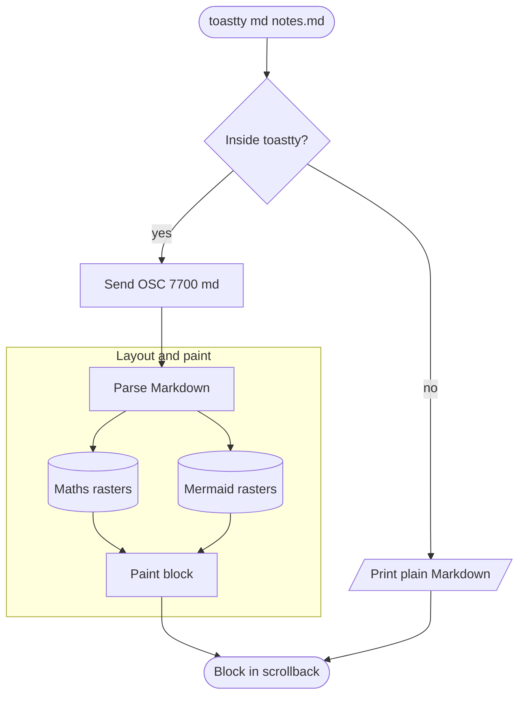
```mermaid
flowchart TD
    Start([toastty md notes.md]) --> Inside{Inside toastty?}
    Inside -->|no| Plain[/Print plain Markdown/]
    Inside -->|yes| Osc[Send OSC 7700 md]
    Osc --> Parse[Parse Markdown]
    subgraph Layout [Layout and paint]
        Parse --> Math[(Maths rasters)] & Mermaid[(Mermaid rasters)]
        Math --> Paint[Paint block]
        Mermaid --> Paint
    end
    Paint --> Done([Block in scrollback])
    Plain --> Done
```

## Sequence diagram

```mermaid
sequenceDiagram
    title Rendering a Markdown block
    autonumber
    actor user as User
    participant cli as toastty md
    participant term as Terminal
    participant md as toastty-markdown
    user->>cli: toastty md README.md
    cli->>term: OSC 7700 ; md ; base64
    activate term
    term->>md: render(src, params)
    md-->>term: RenderedBlock
    deactivate term
    alt fits on screen
        term-->>user: block at cursor
    else taller than the window
        Note over term,md: block scrolls with the text
        term-->>user: scrollable block
    end
    loop on every resize
        term->>md: re-layout at new width
    end
```

## Class diagram

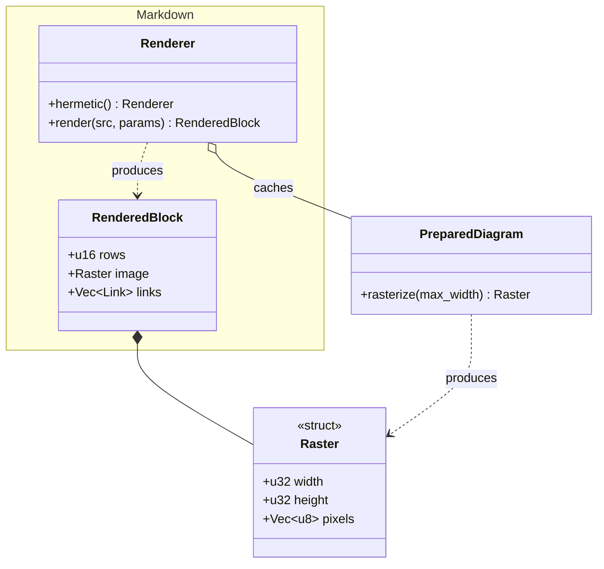
```mermaid
classDiagram
    namespace Markdown {
        class Renderer {
            +hermetic() Renderer
            +render(src, params) RenderedBlock
        }
        class RenderedBlock {
            +u16 rows
            +Raster image
            +Vec~Link~ links
        }
    }
    class Raster {
        <<struct>>
        +u32 width
        +u32 height
        +Vec~u8~ pixels
    }
    class PreparedDiagram {
        +rasterize(max_width) Raster
    }
    Renderer ..> RenderedBlock : produces
    RenderedBlock *-- Raster
    PreparedDiagram ..> Raster : produces
    Renderer o-- PreparedDiagram : caches
```

## State diagram

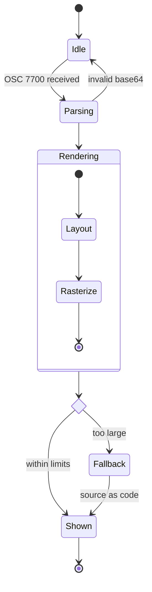
```mermaid
stateDiagram-v2
    [*] --> Idle
    Idle --> Parsing : OSC 7700 received
    Parsing --> Idle : invalid base64
    state Rendering {
        [*] --> Layout
        Layout --> Rasterize
        Rasterize --> [*]
    }
    Parsing --> Rendering
    state fits <<choice>>
    Rendering --> fits
    fits --> Shown : within limits
    fits --> Fallback : too large
    Fallback --> Shown : source as code
    Shown --> [*]
```

## Entity relationship diagram

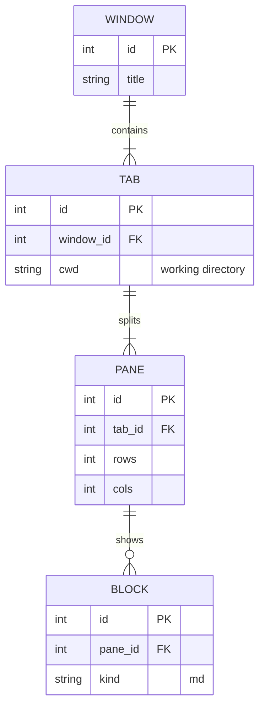
```mermaid
erDiagram
    WINDOW {
        int id PK
        string title
    }
    TAB {
        int id PK
        int window_id FK
        string cwd "working directory"
    }
    PANE {
        int id PK
        int tab_id FK
        int rows
        int cols
    }
    BLOCK {
        int id PK
        int pane_id FK
        string kind "md"
    }
    WINDOW ||--|{ TAB : contains
    TAB ||--|{ PANE : splits
    PANE ||--o{ BLOCK : shows
```

## Gantt chart

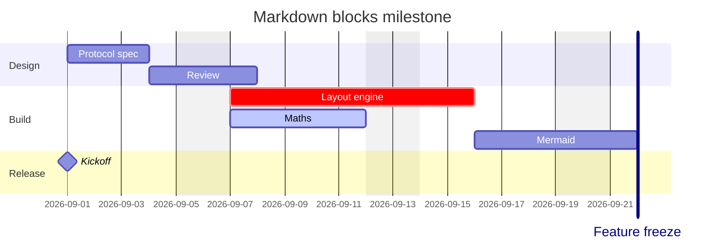
```mermaid
gantt
    title Markdown blocks milestone
    dateFormat YYYY-MM-DD
    excludes weekends
    section Design
    Protocol spec : a1, 2026-09-01, 3d
    Review : after a1, 2d
    section Build
    Layout engine : crit, b1, 2026-09-07, 1w
    Maths : active, 2026-09-07, 5d
    Mermaid : after b1, 4d
    section Release
    Kickoff : milestone, 2026-09-01, 0d
    Feature freeze : vert, v1, 2026-09-22, 0d
```

## Pie chart

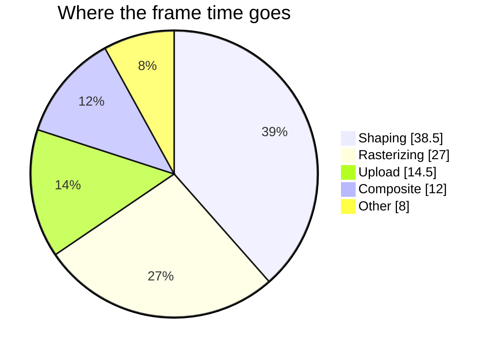
```mermaid
pie showData title Where the frame time goes
    "Shaping" : 38.5
    "Rasterizing" : 27.0
    "Upload" : 14.5
    "Composite" : 12.0
    "Other" : 8.0
```

## User journey

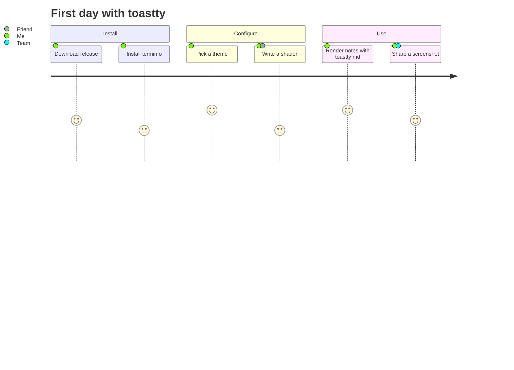
```mermaid
journey
    title First day with toastty
    section Install
      Download release: 4: Me
      Install terminfo: 3: Me
    section Configure
      Pick a theme: 5: Me
      Write a shader: 3: Me, Friend
    section Use
      Render notes with toastty md: 5: Me
      Share a screenshot: 4: Me, Team
```

## Timeline

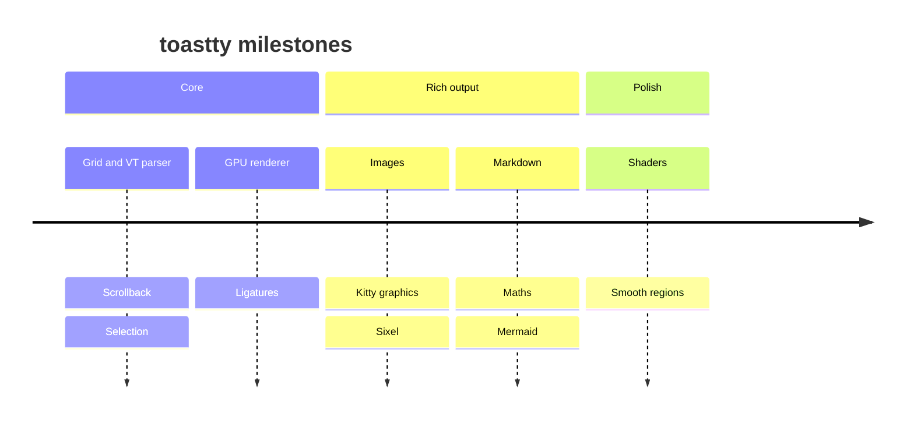
```mermaid
timeline
    title toastty milestones
    section Core
      Grid and VT parser : Scrollback
                         : Selection
      GPU renderer : Ligatures
    section Rich output
      Images : Kitty graphics
             : Sixel
      Markdown : Maths
               : Mermaid
    section Polish
      Shaders : Smooth regions
```

## Mindmap

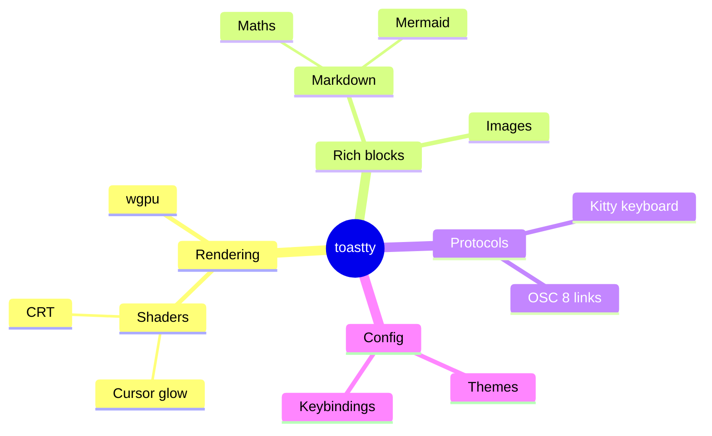
```mermaid
mindmap
root((toastty))
  Rendering
    wgpu
    Shaders
      CRT
      Cursor glow
  Rich blocks
    Markdown
      Maths
      Mermaid
    Images
  Protocols
    Kitty keyboard
    OSC 8 links
  Config
    Themes
    Keybindings
```

## Git graph

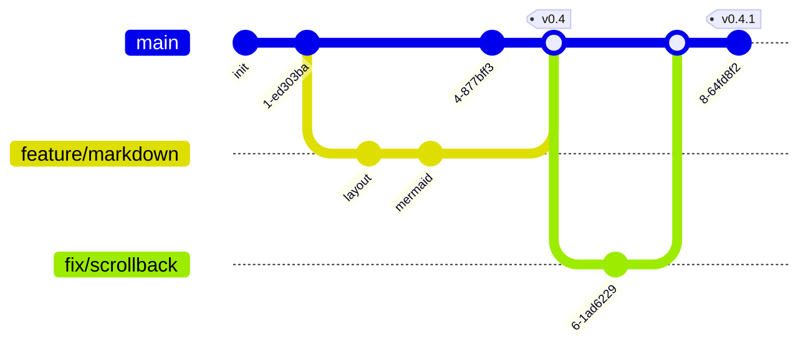
```mermaid
gitGraph
   commit id: "init"
   commit
   branch feature/markdown
   checkout feature/markdown
   commit id: "layout"
   commit id: "mermaid"
   checkout main
   commit
   merge feature/markdown tag: "v0.4"
   branch fix/scrollback
   checkout fix/scrollback
   commit
   checkout main
   merge fix/scrollback
   commit tag: "v0.4.1"
```

## Quadrant chart

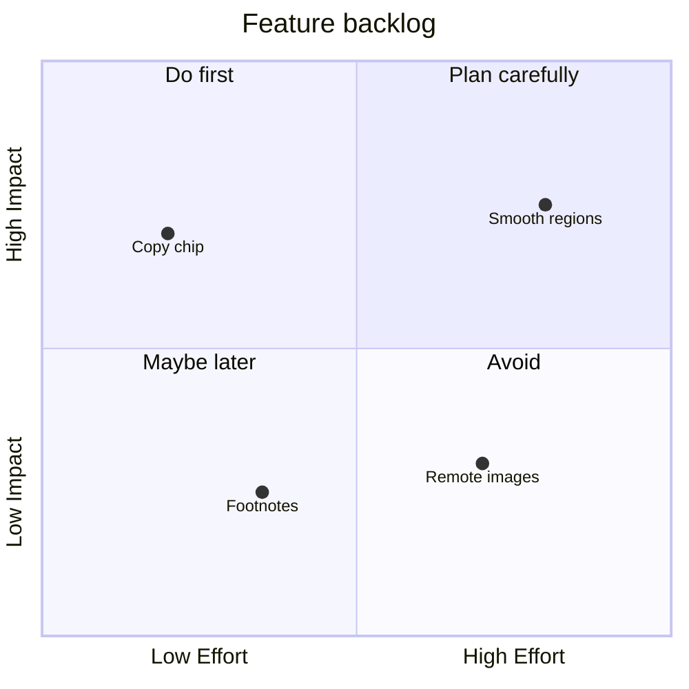
```mermaid
quadrantChart
    title Feature backlog
    x-axis Low Effort --> High Effort
    y-axis Low Impact --> High Impact
    quadrant-1 Plan carefully
    quadrant-2 Do first
    quadrant-3 Maybe later
    quadrant-4 Avoid
    Copy chip: [0.2, 0.7]
    Smooth regions: [0.8, 0.75]
    Footnotes: [0.35, 0.25]
    Remote images: [0.7, 0.3]
```

## XY chart

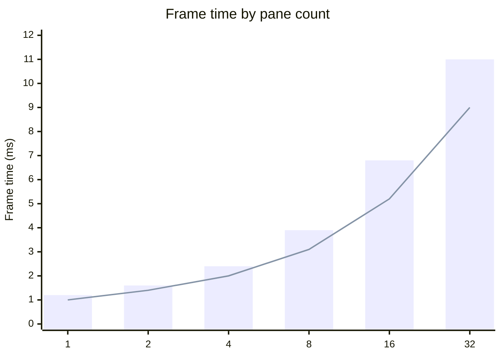
```mermaid
xychart-beta
    title "Frame time by pane count"
    x-axis [1, 2, 4, 8, 16, 32]
    y-axis "Frame time (ms)" 0 --> 12
    bar [1.2, 1.6, 2.4, 3.9, 6.8, 11.0]
    line [1.0, 1.4, 2.0, 3.1, 5.2, 9.0]
```

## Sankey

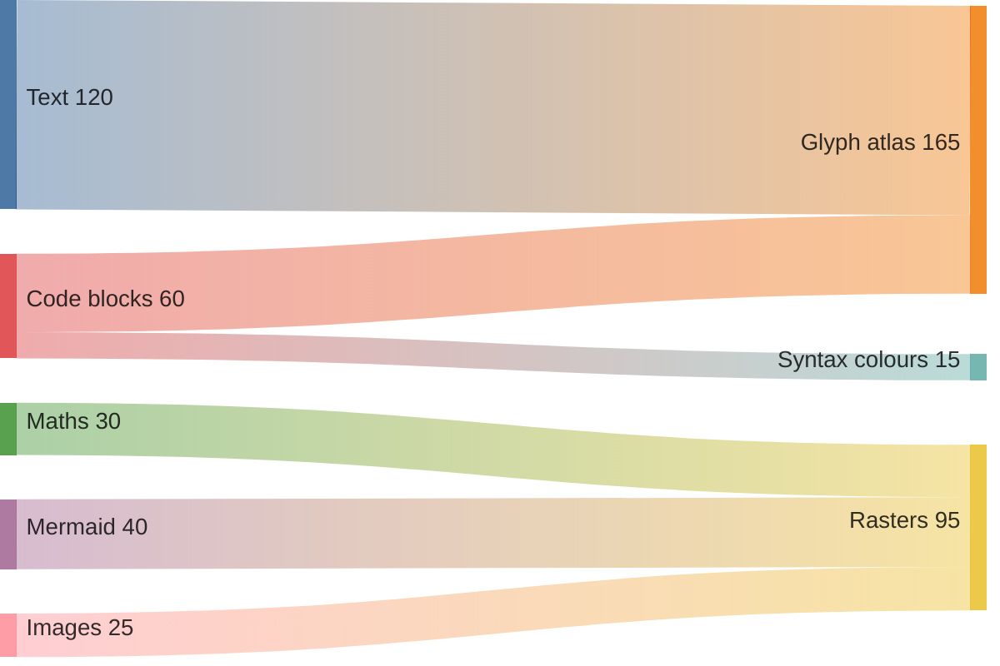
```mermaid
sankey-beta
Text,Glyph atlas,120
Code blocks,Glyph atlas,45
Code blocks,Syntax colours,15
Maths,Rasters,30
Mermaid,Rasters,40
Images,Rasters,25
```

## Radar

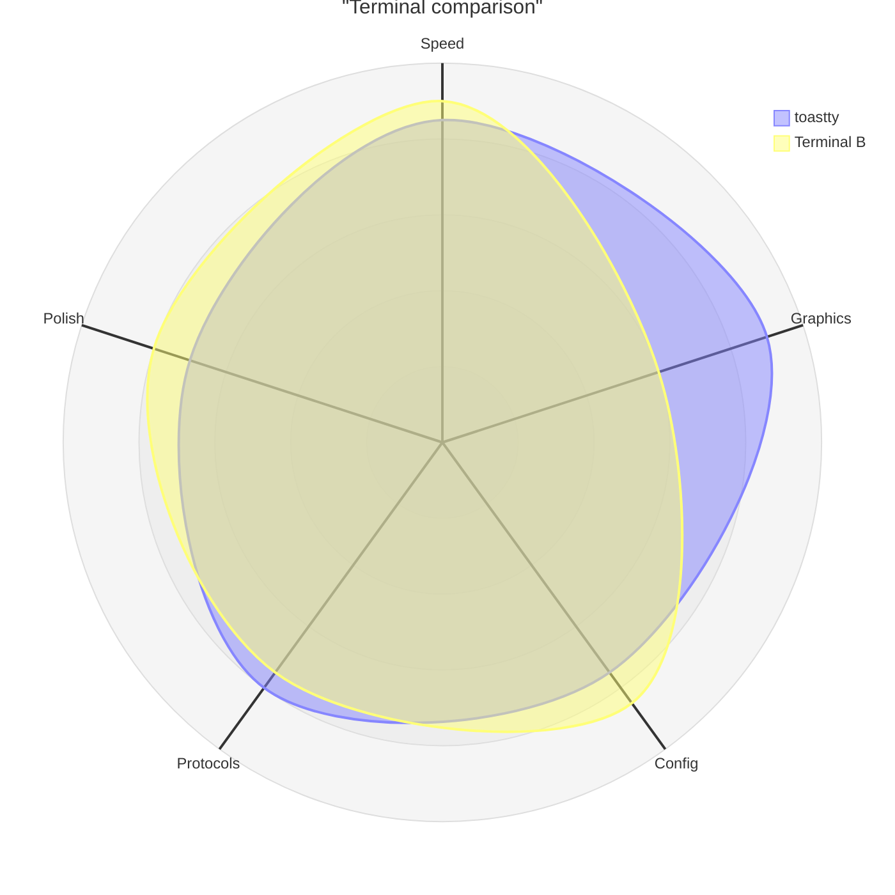
```mermaid
radar-beta
    title "Terminal comparison"
    axis A["Speed"], B["Graphics"], C["Config"], D["Protocols"], E["Polish"]
    curve a["toastty"]{85, 90, 75, 80, 70}
    curve b["Terminal B"]{90, 60, 85, 75, 80}
    max 100
```

## Packet

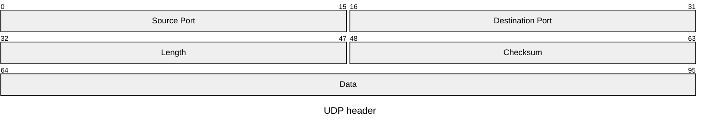
```mermaid
packet-beta
    title UDP header
    0-15: "Source Port"
    16-31: "Destination Port"
    32-47: "Length"
    48-63: "Checksum"
    64-95: "Data"
```

## Requirement diagram

```mermaid
requirementDiagram
requirement hermetic_fonts {
    id: 1
    text: diagrams use bundled fonts only
    risk: low
    verifymethod: test
}
performanceRequirement fast_render {
    id: 2
    text: large diagrams render quickly
    risk: medium
    verifymethod: analysis
}
element mermaid_rs {
    type: module
    docref: "src/mermaid.rs"
}
element golden_tests {
    type: test
}
mermaid_rs - satisfies -> hermetic_fonts
golden_tests - verifies -> hermetic_fonts
hermetic_fonts - derives -> fast_render
```

## C4

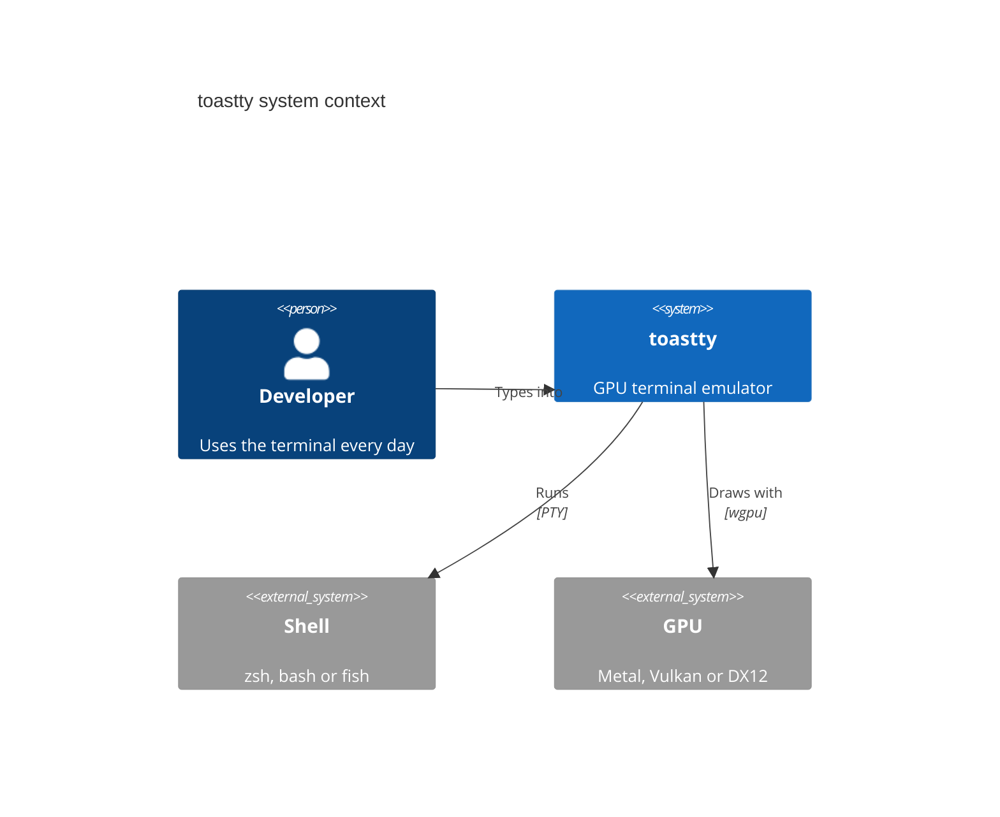
```mermaid
C4Context
    title toastty system context
    Person(user, "Developer", "Uses the terminal every day")
    System(toastty, "toastty", "GPU terminal emulator")
    System_Ext(shell, "Shell", "zsh, bash or fish")
    System_Ext(gpu, "GPU", "Metal, Vulkan or DX12")
    Rel(user, toastty, "Types into")
    Rel(toastty, shell, "Runs", "PTY")
    Rel(toastty, gpu, "Draws with", "wgpu")
```

## Block diagram

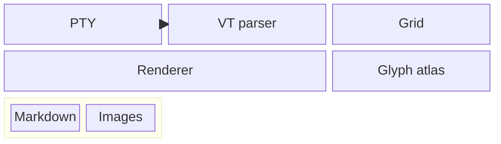
```mermaid
block-beta
    columns 3
    pty["PTY"] parser["VT parser"] grid["Grid"]
    renderer["Renderer"]:2 atlas["Glyph atlas"]
    block:rich
      md["Markdown"] img["Images"]
    end
    pty --> parser
```

## Architecture

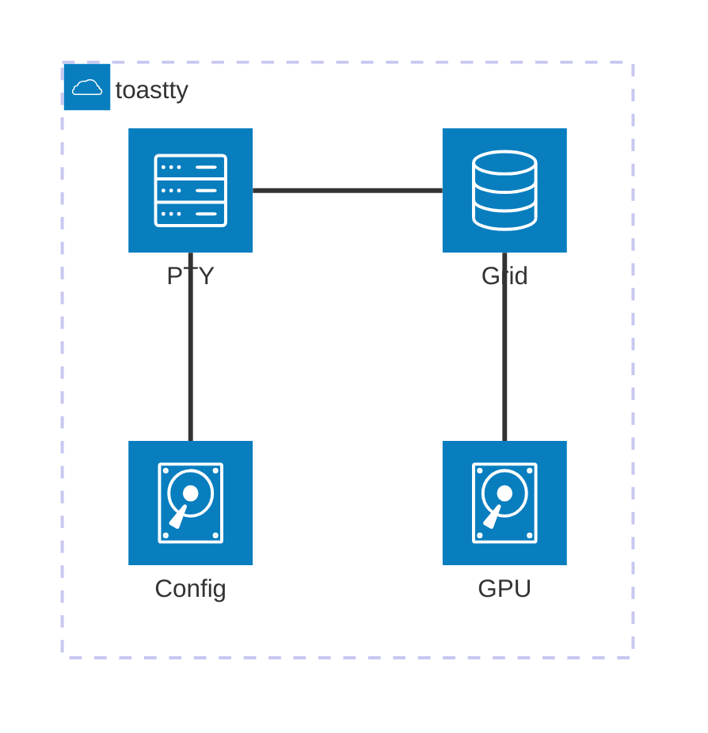
```mermaid
architecture-beta
    group app(cloud)[toastty]
    service pty(server)[PTY] in app
    service grid(database)[Grid] in app
    service gpu(disk)[GPU] in app
    service cfg(disk)[Config] in app
    pty:R -- L:grid
    grid:B -- T:gpu
    cfg:T -- B:pty
```

## Kanban

```mermaid
kanban
  todo[Todo]
    k1[Footnotes]
    k2[Remote images]@{ priority: 'Low' }
  doing[In progress]
    k3[Mermaid gallery]@{ assigned: 'Howard', priority: 'High' }
  review[Review]
    k4[Reference pin]@{ assigned: 'Howard', priority: 'Very High' }
  done[Done]
    k5[Smooth regions]
    k6[Cursor glow shader]
```

## Treemap

```mermaid
treemap-beta
    title Lines of code by crate
    "Core"
      "toastty-term": 42
      "toastty-vt": 18
    "Rendering"
      "toastty-render": 30
      "toastty-markdown": 22
    "App"
      "toastty": 25
      "toastty-config": 8
```

## ZenUML

```mermaid
zenuml
    title Ctrl+click a link
    @Actor User
    @Boundary Window
    @Control Terminal
    @Database Links
    User -> Window.click(x, y) {
        Terminal.hit(x, y) {
            link = Links.at(row, col)
            if (link) {
                return open
            } else {
                return ignore
            }
        }
        Window.redraw()
    }
```
